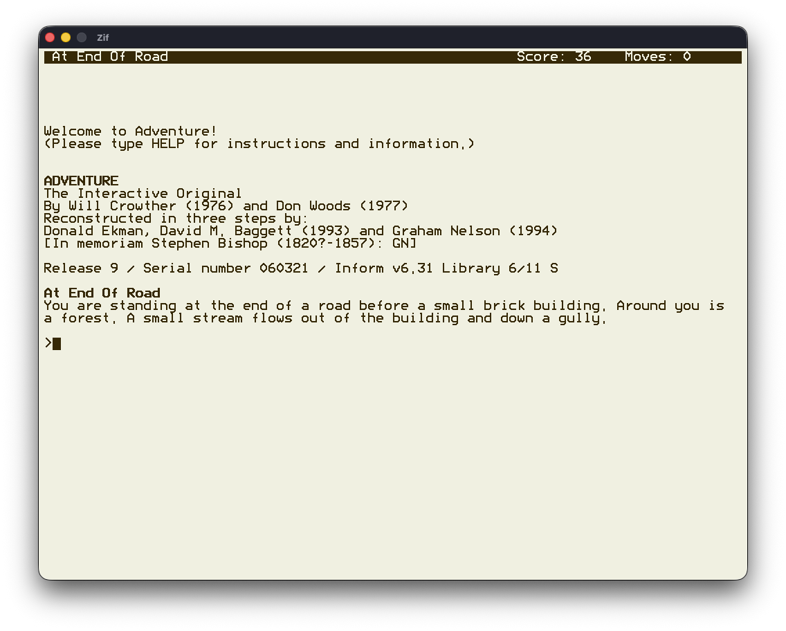

## About

A Z-code engine for interactive fiction games.

A key goal of **Zif** is portability across different platforms and specifically
portability to the third-generation Kindle, aka Kindle Keyboard. The Kindle keyboard
appears as an ideal platform for playing interactive fiction.

**Zif** includes an optional terminal emulator and a basic curses style front-end menu to
select story files. When running on a Kindle, a third-party terminal emulator and
launcher is not necessary.

Several excellent Z-code engines already exist, and some have already been ported to the Kindle.

## Status

**Zif** is playable and has been built and verified to run on various platforms. Almost all Z-code files, .z# and .zblorb, downloaded from the interactive fiction archive, start
to run as expected. (817/819)

Although further testing is required, initial results indicate that enough functionality has been implemented to play most available games.



### Supported Platforms

+ Linux
+ macOS
+ Kindle Keyboard (3rd generation)

## Usage

**Zif** should be run from the directory where it was installed. Starting **Zif** without any
command line arguments will start the front-end menu using the built-in terminal emulator.

The games available from the menus should be stored in the `Games` sub-directory and listed in the file `Games/list`.

The command line option `--help` (or `-h`) displays a list of the available command line options. Supplying a Z-code game file as a command line argument will load and run the game file directly bypassing the front-end menus.

```
NAME
     Zif - Z-code engine for interactive fiction

SYNOPSIS
     zif [options] [<story-file>]

OPTIONS
     -v,--version             Display version information
     -h,--help                Display this help
     -t,--term                Use the parent terminal (not the built in terminal emulator)
     -K,--k3                  Kindle 3 display 600x800
     -V,--vga                 VGA display      640x480
     -S,--svga                SVGA display     800x600
     -X,--xga                 XGA display     1024x768
     --sxga                   SXGA display    1280x1024
     --info                   Report information messages
     --warn                   Report warning messages
     -w,--width <unsigned>    Override output width [0]
     -b,--batch               Batch mode, disable output to screen
     -T,--trace               Trace execution to "trace.log"
     -p,--print               Print output to "print.log"
     -k,--key                 Log key presses to "key.log"
     -i,--input <string>      Read keyboard input from a file
     -S,--seed <unsigned>     Initial random number seed [0]
     -u,--undo <unsigned>     Number of undo buffers [4]
     -s,--save-dir <string>   Directory for save files ["Saves"]
```

### More Games

Interactive fiction games can be downloaded from:
+ [Interactive Fiction Archive](http://ifarchive.org/)
+ [Interactive Fiction Database](http://ifdb.tads.org/)

## Thanks & Acknowledgements

Graham Nelson for his *Z-Machine Standards Document* and associated test programs. Andrew Plotkin for his *Z-machine Exerciser*. The contributors to Frotz, which has been an invaluable reference of correct Z-Machine behaviour. The Z-Code authors, and everyone else
involved, for enabling their Z-code files to be freely available at the [Interactive
Fiction Archive](http://ifarchive.org/) and the [Interactive Fiction Database](http://ifdb.tads.org/)
